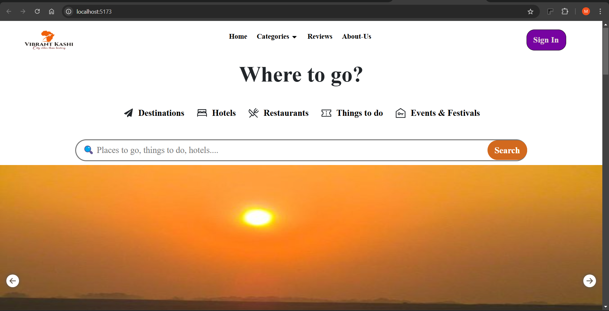
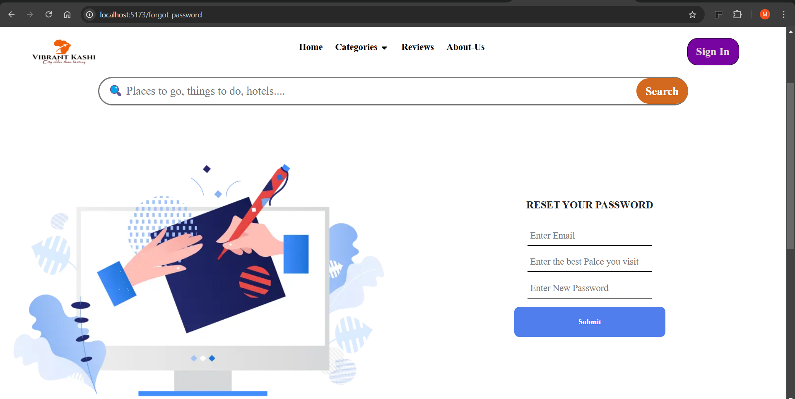
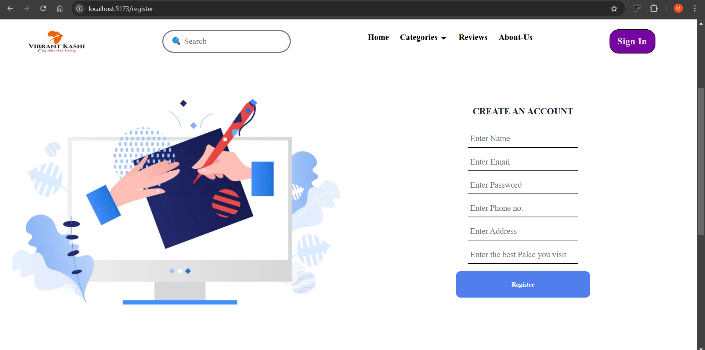
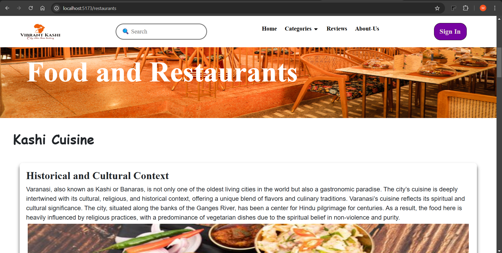
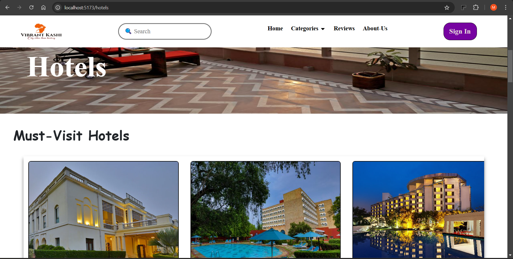
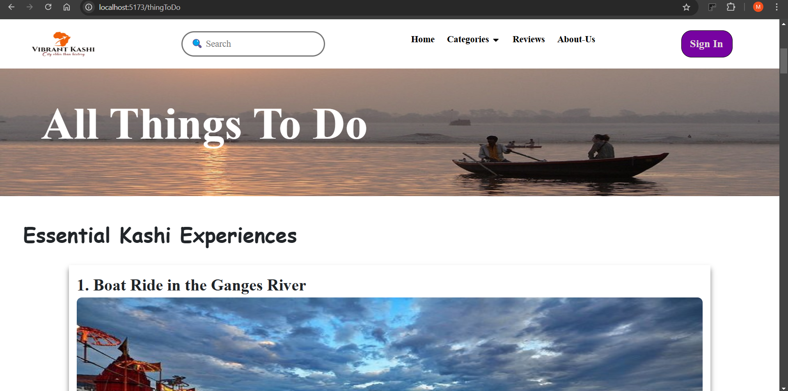
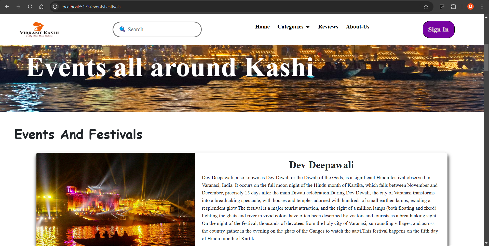
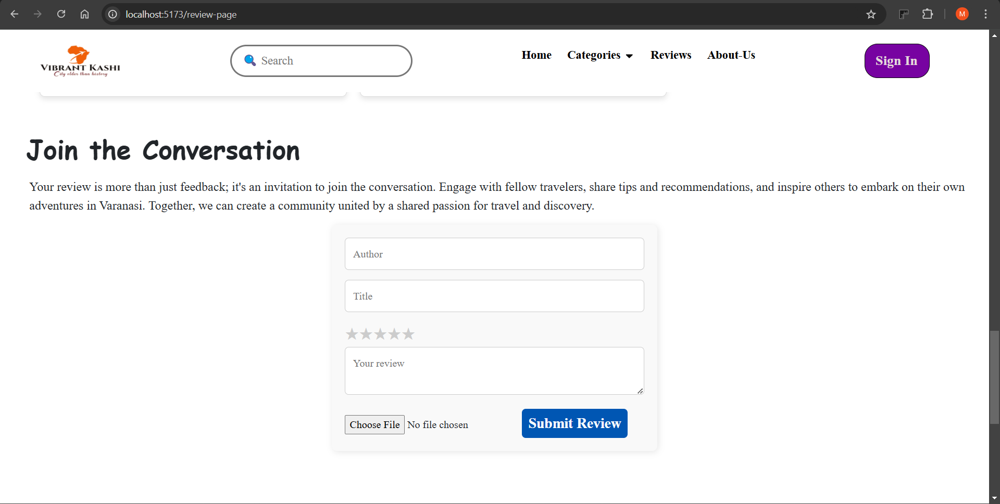
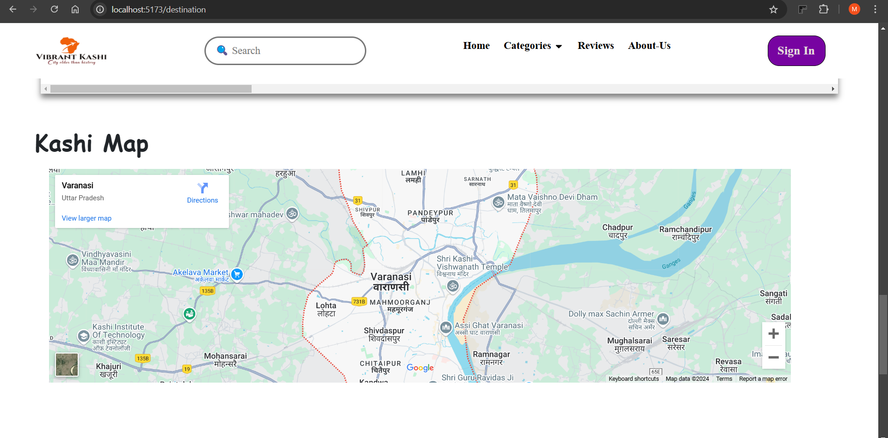

# 🌆 Vibrant Kashi – Your Ultimate Guide to Varanasi

Welcome to **Vibrant Kashi** – an immersive travel guide dedicated to exploring the spiritual and cultural beauty of Varanasi. This website covers everything from landmarks to food, events, and accommodations, providing a complete experience of Varanasi.

---

## 📜 Table of Contents

- [About the Project](#about-the-project)
- [Features](#features)
- [Screenshots](#screenshots)
- [Technologies Used](#technologies-used)
- [Project Structure](#project-structure)

---

## 📖 About the Project

**Vibrant Kashi** is a website created to guide tourists and locals in exploring Varanasi's landmarks, food spots, accommodations, and events. This project provides an authentic virtual experience of Varanasi's charm and history.

---

## ✨ Features

- **📍 Explore Landmarks**: Discover famous sites like Kashi Vishwanath Temple and Dashashwamedh Ghat.
- **🍲 Food Guide**: Curated list of must-try local dishes and eateries.
- **🏨 Accommodations**: Hotels and guesthouses for every budget.
- **📅 Events Calendar**: Stay updated on festivals and ceremonies.
- **🔹 Easy Navigation**: Simple and responsive design.

---

## 📸 Screenshots

**Visual representation of the main sections of Vibrant Kashi**:

### Homepage

  
_Overview of Varanasi and key highlights_

### About Kashi

  
_Insight into the historical and cultural background of Kashi_

### Login Page

  
_User login interface for accessing personalized features_

### Reset Password

  
_Password reset functionality for account security_

### Register Page

  
_User registration to access app features_

### See Kashi in Variety of Ways

  
_Explore diverse perspectives of Kashi and discover unique experiences_

### Landmarks

  
_Famous landmarks and descriptions_

### Food Guide

  
_Explore local cuisine options_

### Hotels

  
_Find accommodations in Varanasi_

### Things to Do

  
_Recommended activities in Varanasi_

### Events and Festivals

  
_Explore events and festivals happening in Kashi_

### Reviews

  
_Read user reviews on places and experiences_

### Kashi Map

  
_Map of Varanasi with highlighted attractions_

### About Us

  
_Information about the creators and purpose of Vibrant Kashi_

---

## 🔧 Technologies Used

- **_Frontend:_** HTML, CSS, JavaScript, React
- **_Backend:_** Node.js, Express
- **_Database:_** MongoDB
- **_Version Control:_** Git and GitHub

---

## 📁 Project Structure

Vibrant-Kashi/
├── client/
│ ├── public/
│ ├── src/
│ ├── package.json
│ └── README.md
│
├── server/
│ ├── config/
│ ├── controllers/
│ ├── middleware/
│ ├── models/
│ ├── routes/
│ ├── utils/
│ ├── server.js
│ └── package.json
│
├── .gitignore
└── README.md
